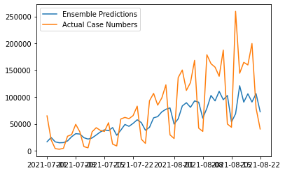

## TweetCaster: Predicting Pandemic Trends from Tweets

## Team Members

        

            Pratik Nallamotu
            
        

        

            Junyan Mao
             
        

        

            Rachit Bhargava
            
        

 

## Summary of TweetCaster

In this paper we research the correlation between COVID-19 related tweets and number of new COVID-19 cases. We propose a machine learning model using natural language processing techniques to analyze keywords and sentiments of COVID-19 related tweets to predict future COVID-19 spikes. We utilized a dataset of COVID-19 related tweets and a data repository of COVID-19 time series data from the United States. 

<h2>Results</h2>

From analyzing our dataset’s sentiment of the tweets, we wanted to research further upon whether we could predict new COVID-19 cases based only on sentiment information using a multivariable regression model. The model is able to get a sense of rise and fall in number of cases over the week and weekend. 
<figure>
  
  <figcaption>Predicted Number of Cases with Multi-variable
Linear Regression with Sentiment Analysis Data</figcaption>
</figure>

Since our dataset was a time series dataset, we used times series models of ARIMA, OLS, an ensemble of ARIMA + OLS to predict new code cases. We found that Arima did a fairly well job at predicting sudden rises of COVID-19 cases, but OLS and the ensemble of the two were of poor performance. 

We also encoded the tweets with BERT and TF-IDF and found that both produce equally good results.

## Report

Here is our report: <a href="./CSE8803_final_report.pdf" download>Report</a>
 

## Presentation Slides

## Software
